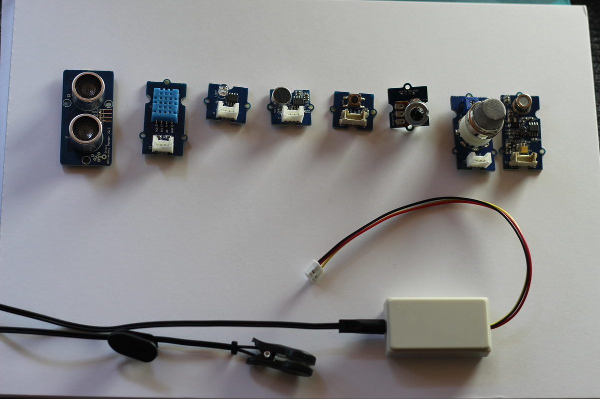
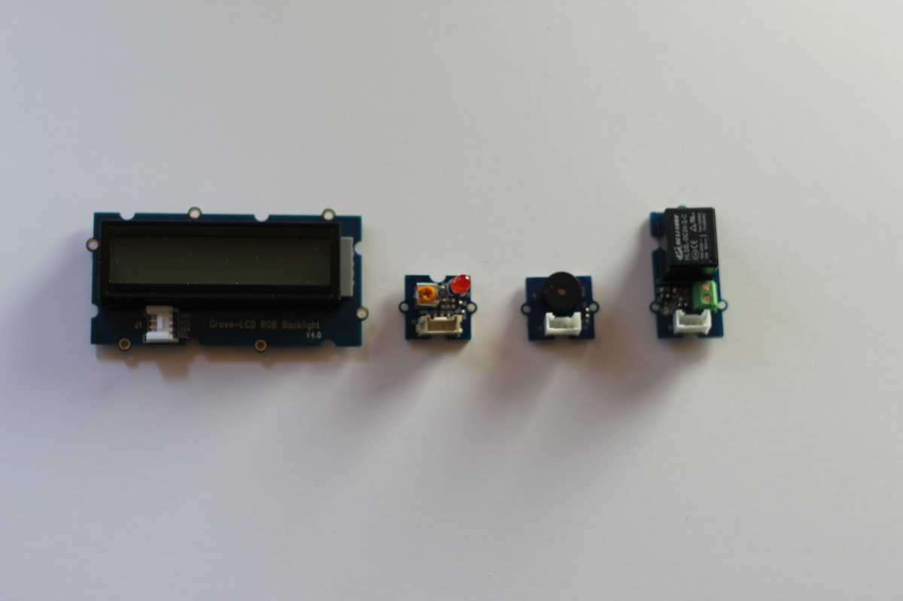

# OpenDASH GrovePI Nodes

## Installation

1. Add dependency to `.node_red/package.json`
2. `npm install`
3. `node-red-restart`

## Sensors

The bulue sensors are DHT11 humidity & temperature sensors.

## Nodes

See <https://www.dexterindustries.com/GrovePi/engineering/port-description/>

In addition to a node for each of the most common sensors,
there are four “general” nodes.

1. Digital Input, values: 0 or 1
2. Analog Input, values: 0 to 1023
3. Digital Output, values: 0 or 1
4. Analog Output, values: 0 to 255

## `msg` Properties

See <https://nodered.org/docs/user-guide/messages>

Usually, the "value" of a message is stored in its `payload` field.
To make integration with other nodes easy, the payload of a sensor
message only contains its values, all additional information is stored
in other properties.

If a sensor returns multiple values (e.g. temperature and humidity),
`msg.payload` is an array of these values.

In addition to that, `msg.valueTypes` is an array of value type
specifications `{unit: ..., name: ..., type: ...}`.

This additional information is used for displaying sensor values on the LCD
and when sending datapoints to the OpenDash platform.

## Sensor Modes

Sensors can be used in two different configurations, in _live_ or in
_interval_ mode.

In _live_ mode, the sensors are polled as often as possible but only
send events when the new value is different.  It's well suited for
building applications with alarms or actions triggered by the sensors
values.

In _interval_ mode, sensors send an event every n seconds
(configurable).  It's intended to be used to provide a consistent data
stream for logging applications.

To prevent wrongly configured sensors from hanging up the system,
the fastest sampling rate allowed is once every 50ms.

## Inputs / Sensors

From left to right:

1. Ultrasonic Ranger
2. DTH22 Temperature & Humidity Sensor
3. Light Sensor
4. Loudness Sensor
5. Button
6. Rotary Angle Sensor
7. Gas Sensor
8. Air Quality Sensor

At the bottom:

1. Heart Rate Sensor

## Outputs / Actuators

From left to right:

1. LCD RGB-Backlight
2. LED
3. Buzzer
4. Relay

## Sensors

### I2C Sensors

When connecting a I2C sensor, it doesn't matter which pin is used.

### Loudness Sensor

Records 5 samples per second, then sends out the average and the
maximum value.

## Credits

There are two existing collections of GrovePI sensor nodes for NodeRed:
- <https://github.com/memetolsen/node-red-grovepi-nodes>
- <https://github.com/O-Hahn/node-red-contrib-grovepi>
- <https://github.com/DexterInd/GrovePi/tree/master/Software/NodeJS>

What makes this package different from the ones listed above is that
each sensor includes some metadata about the values it sends in the
message. This way, sensors can be connected to meaningful OpenDASH
data streams without configuring the value types by hand.
